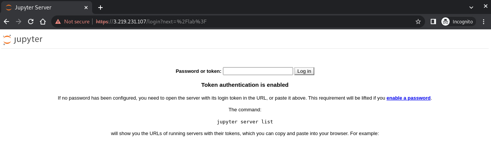
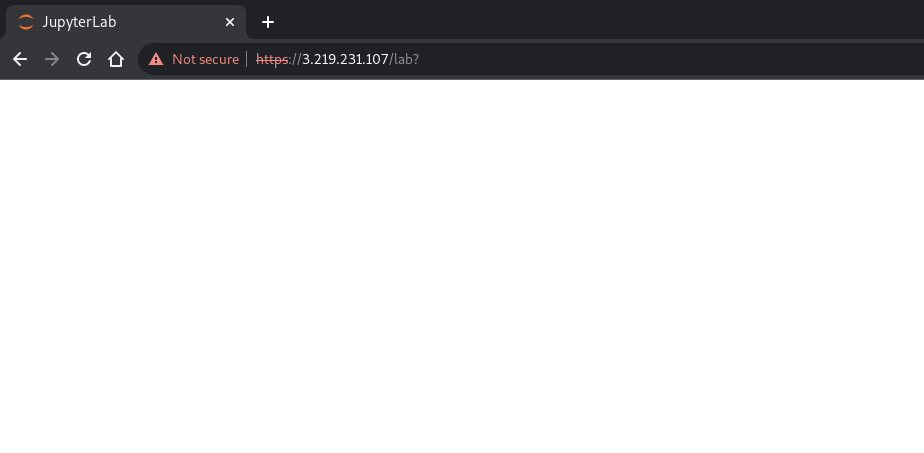

# Ideal Octo Parakeet 
Terraform AWS EC2 instance, DataScience Jupyter notebook and nginx proxy IPv6 subnet installed locally. Jupyter + nginx config derived from:

https://gist.github.com/paparaka/294450b727c2aa5455e7125f695e54ed
https://nedjalkov-ivan-j.medium.com/jupyter-lab-behind-a-nginx-reverse-proxy-the-docker-way-8f8d825a2336

This is a horribly cheap way of spinning up Jupyter for demo only. Don't use this for production:
* Not highly available
* No backups
* Is in a single AZ
* Doesn't use EFS
* Doesn't use CloudFront. 
* Doesn't have enough RAM or CPU to do anything useful in DS.

Based on a t3.nano which has 500MB of memory, this can lead to OOMs when performing a yum install. Added a temporary swapfile to work around this in the userdata.sh.

## Interview Mode
This has as a training exercise mode to see if an engineer can detect why the workspace is broken and what they do about it in a paired programming exercise.  This is set with the break_workspace value in variables.tf:

break_workspace = true

The candidate should be able to login to Jupyter using the provided URL and the token in the output:



They will be presented with a white screen and asked to fix this.



The terraform output is provided to pass to the candidate to login via SSH and investigate. You will need to send them the .pem file below:

```
SSH-string = "ssh -i ideal-octo-parakeet.pem -oPort=2020 ec2-user@44.192.104.111"
Time-Date = "2022-05-15T10:05:31Z"
Web-Server-URL = "https://44.192.104.111"
jupyter-token = "<obfuscated>"
```

The problem can be triaged using [answers.md](answers.md)
